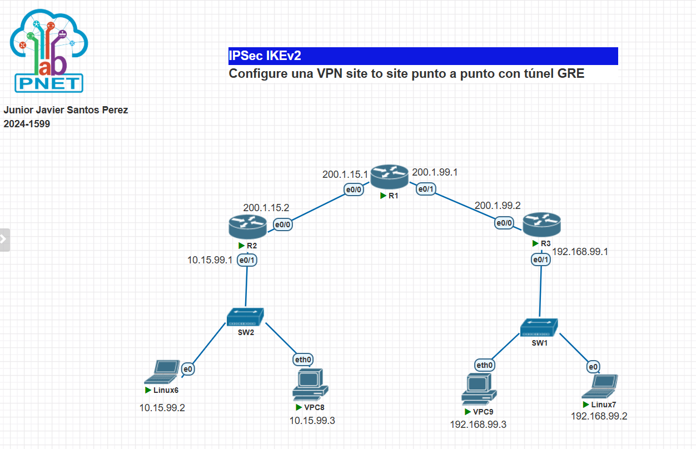
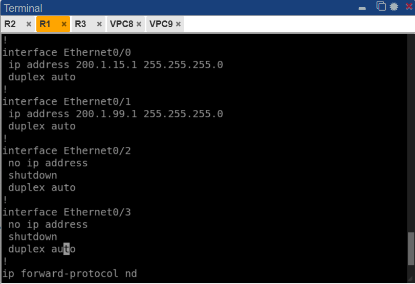
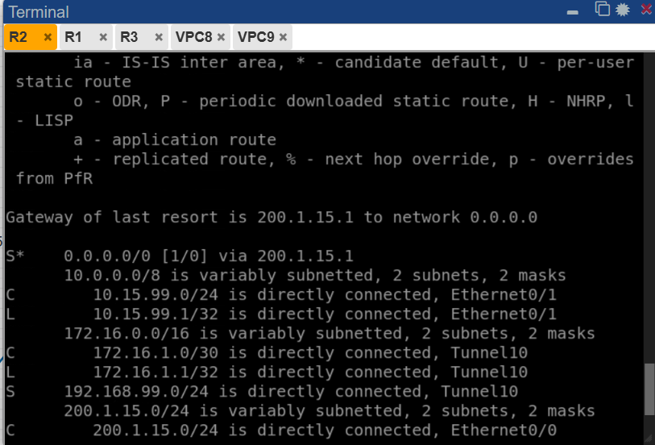
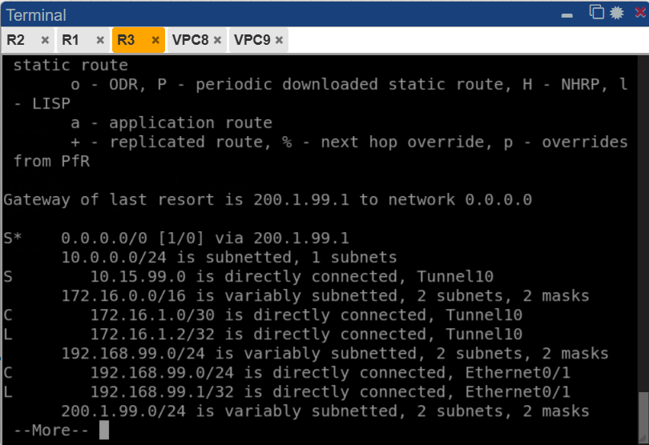
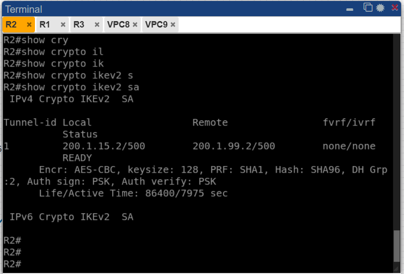
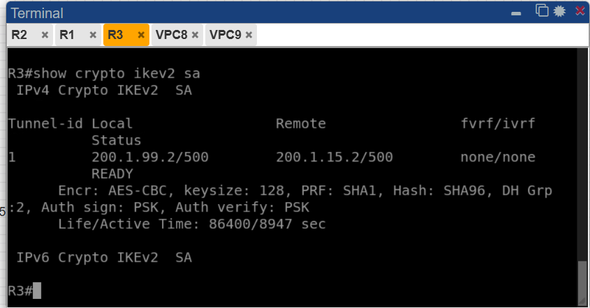
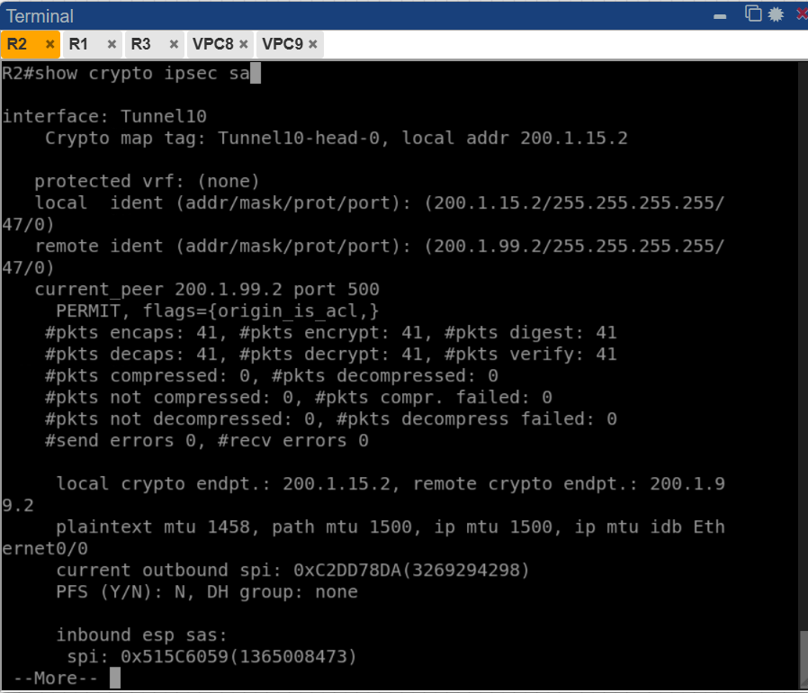
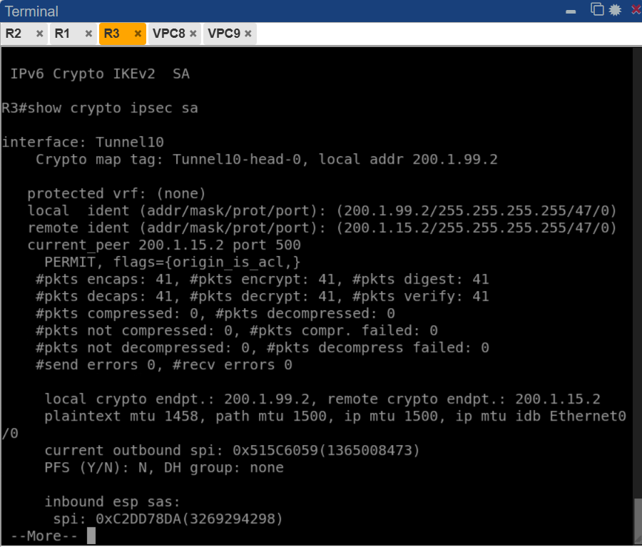
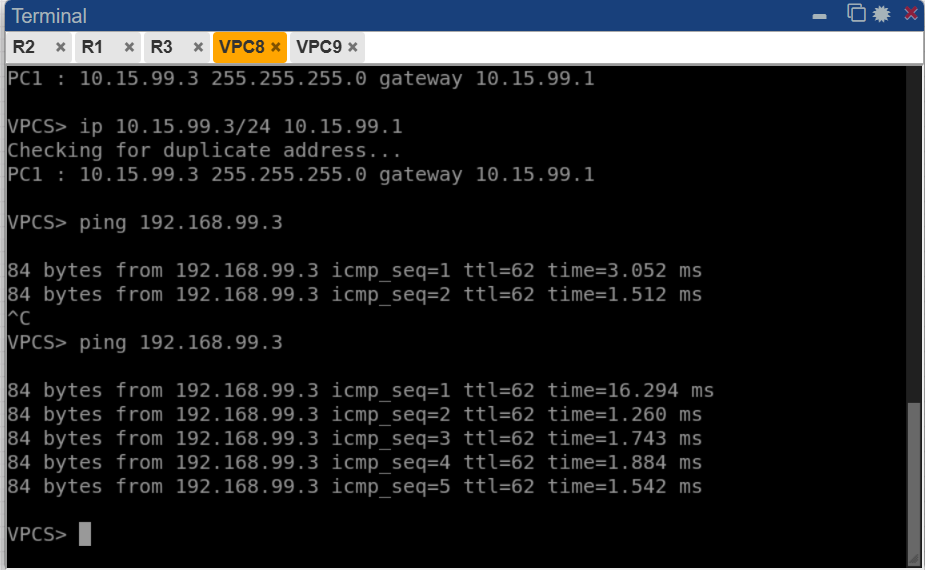
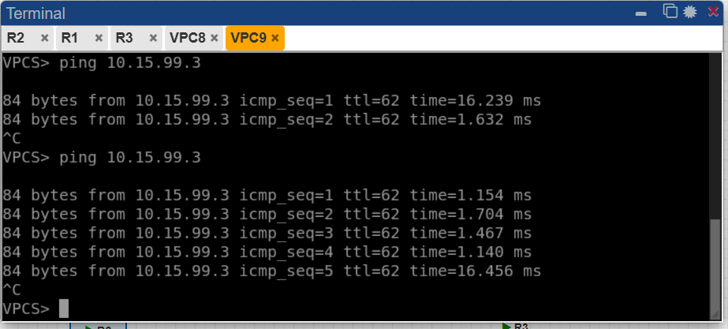

# Documentación Técnica — VPN Site-to-Site IPSec IKEv2 con Túnel GRE

**Estudiante:** Junior Javier Santos Perez
**Matrícula:** 2024-1599


Video demostrativo: https://www.youtube.com/watch?v=PTlXa6dsAnQ 


Link GitHub: https://github.com/juniorjaviersantosperez/IPSec-IKEv2-Configure-una-VPN-site-to-site-punto-a-punto-con-t-nel-GRE.git 


---

## 1. Objetivo

El objetivo de esta práctica es configurar una **VPN Site-to-Site punto a punto con túnel GRE protegido por IPSec IKEv2**, que permite la comunicación cifrada entre las redes LAN de dos sitios remotos (R2 y R3) a través de una red pública simulada por R1.

Esta solución combina dos tecnologías complementarias:

- **GRE (Generic Routing Encapsulation):** crea un túnel virtual (`Tunnel0`) entre los dos routers, permitiendo encapsular tráfico IP y simplificando el enrutamiento estático hacia las LANs remotas.
- **IPSec IKEv2:** protege el tráfico GRE mediante una asociación de seguridad negociada con el protocolo IKEv2, usando AES-CBC-128 como cifrado, SHA1 como integridad y autenticación por llave precompartida (PSK).

El modo IPSec utilizado es **transporte**, ya que GRE ya encapsula el paquete original; IPSec cifra únicamente la carga GRE sin añadir un encabezado IP adicional. IKEv2 reemplaza a IKEv1/ISAKMP con un proceso de negociación más eficiente, seguro y con menos intercambios de mensajes.

---

## 2. Topología de Red


*IMAGEN1 — Topología general del escenario: R1 actúa como ISP/tránsito entre los dos sitios; R2 es el router VPN del Sitio A (LAN 10.15.99.0/24) y R3 del Sitio B (LAN 192.168.99.0/24). Cada sitio tiene un switch (SW2/SW1) que conecta una máquina Linux y un VPC a su red local.*

### 2.1 Direccionamiento IP

| Dispositivo | Interfaz    | Dirección IP     | Descripción                    |
|-------------|-------------|------------------|--------------------------------|
| R1 (ISP)    | e0/0        | 200.1.15.1/24    | Enlace hacia R2                |
| R1 (ISP)    | e0/1        | 200.1.99.1/24    | Enlace hacia R3                |
| R2          | e0/0 (WAN)  | 200.1.15.2/24    | Enlace hacia R1 / Internet     |
| R2          | e0/1 (LAN)  | 10.15.99.1/24    | Red local Sitio A              |
| R2          | Tunnel0     | 172.16.1.1/30    | Interfaz virtual del túnel GRE |
| R3          | e0/0 (WAN)  | 200.1.99.2/24    | Enlace hacia R1 / Internet     |
| R3          | e0/1 (LAN)  | 192.168.99.1/24  | Red local Sitio B              |
| R3          | Tunnel0     | 172.16.1.2/30    | Interfaz virtual del túnel GRE |
| Linux6      | e0          | 10.15.99.2/24    | Host final Sitio A             |
| VPC8        | eth0        | 10.15.99.3/24    | Host final Sitio A             |
| VPC9        | eth0        | 192.168.99.3/24  | Host final Sitio B             |
| Linux7      | e0          | 192.168.99.2/24  | Host final Sitio B             |

### 2.2 Roles de cada dispositivo

- **R1:** simula el ISP. Solo enruta paquetes IP entre las dos WAN públicas, sin conocimiento del túnel GRE/IPSec.
- **R2:** router VPN del Sitio A. Origina el túnel GRE `Tunnel0` hacia R3 y negocia la sesión IKEv2.
- **R3:** router VPN del Sitio B. Termina el túnel GRE y responde a la negociación IKEv2 iniciada por R2.

---

## 3. Paso 1 — Configuración de Interfaces y Ruta por Defecto

Cada router recibe su dirección IP en la interfaz WAN (hacia R1) y en la interfaz LAN (hacia su switch local). Se configura una ruta por defecto que envía el tráfico desconocido hacia R1.

**R1 (ISP):**
```
interface e0/0
 ip address 200.1.15.1 255.255.255.0
 no shutdown
interface e0/1
 ip address 200.1.99.1 255.255.255.0
 no shutdown
```


*IMAGEN3 — Verificación de las interfaces de R1: Ethernet0/0 con dirección 200.1.15.1/24 (hacia R2) y Ethernet0/1 con 200.1.99.1/24 (hacia R3). Las interfaces e0/2 y e0/3 permanecen apagadas por no ser necesarias.*

**R2:**
```
interface e0/0
 ip address 200.1.15.2 255.255.255.0
 no shutdown
interface e0/1
 ip address 10.15.99.1 255.255.255.0
 no shutdown
ip route 0.0.0.0 0.0.0.0 200.1.15.1
```

**R3:**
```
interface e0/0
 ip address 200.1.99.2 255.255.255.0
 no shutdown
interface e0/1
 ip address 192.168.99.1 255.255.255.0
 no shutdown
ip route 0.0.0.0 0.0.0.0 200.1.99.1
```

---

## 4. Paso 2 — Propuesta IKEv2

La propuesta IKEv2 define los algoritmos criptográficos que se ofrecen durante la negociación del canal seguro de control.

```
! R2 y R3 (idéntico en ambos)
crypto ikev2 proposal IKEv2-PROP
 encryption aes-cbc-128
 integrity sha1
 group 2
```

### Parámetros de la propuesta IKEv2

| Parámetro         | Valor        |
|-------------------|--------------|
| Nombre            | IKEv2-PROP   |
| Cifrado           | AES-CBC-128  |
| Integridad        | SHA1         |
| Grupo DH          | 2            |

---

## 5. Paso 3 — Política IKEv2

La política IKEv2 referencia la propuesta y permite que el router la use durante la negociación con el peer remoto.

```
! R2 y R3 (idéntico en ambos)
crypto ikev2 policy IKEv2-POL
 proposal IKEv2-PROP
```

---

## 6. Paso 4 — Keyring (Pre-Shared Key)

El keyring almacena la llave precompartida asociada a cada peer remoto. Es el mecanismo de autenticación entre R2 y R3.

```
! R2
crypto ikev2 keyring GRE-KEYS
 peer R3
  address 200.1.99.2
  pre-shared-key cisco

! R3
crypto ikev2 keyring GRE-KEYS
 peer R2
  address 200.1.15.2
  pre-shared-key cisco
```

---

## 7. Paso 5 — Perfil IKEv2

El perfil IKEv2 vincula la identidad del peer remoto, el método de autenticación y el keyring en un único objeto que será referenciado por el perfil IPSec.

```
! R2
crypto ikev2 profile IKEv2-PROF
 match identity remote address 200.1.99.2
 authentication local pre-share
 authentication remote pre-share
 keyring local GRE-KEYS

! R3
crypto ikev2 profile IKEv2-PROF
 match identity remote address 200.1.15.2
 authentication local pre-share
 authentication remote pre-share
 keyring local GRE-KEYS
```

---

## 8. Paso 6 — IPSec Transform-Set y Perfil IPSec

El transform-set define cómo se cifra el tráfico real (la carga GRE). El modo **transporte** se usa porque GRE ya provee la encapsulación; IPSec solo necesita cifrar el payload. El perfil IPSec vincula el transform-set con el perfil IKEv2.

```
! R2 y R3 (idéntico en ambos)
crypto ipsec transform-set GRE-SET esp-aes esp-sha-hmac
 mode transport
!
crypto ipsec profile GRE-PROFILE
 set transform-set GRE-SET
 set ikev2-profile IKEv2-PROF
```

### Parámetros del Transform-Set

| Parámetro       | Valor        |
|-----------------|--------------|
| Nombre          | GRE-SET      |
| Protocolo ESP   | esp-aes      |
| Integridad ESP  | esp-sha-hmac |
| Modo            | Transporte   |

---

## 9. Paso 7 — Interfaz Túnel GRE

Se crea la interfaz virtual `Tunnel0` que encapsula el tráfico entre los dos sitios. El perfil IPSec se aplica directamente sobre el túnel para cifrarlo con IKEv2.

```
! R2
interface Tunnel0
 ip address 172.16.1.1 255.255.255.252
 tunnel source 200.1.15.2
 tunnel destination 200.1.99.2
 tunnel mode gre ip
 tunnel protection ipsec profile GRE-PROFILE

! R3
interface Tunnel0
 ip address 172.16.1.2 255.255.255.252
 tunnel source 200.1.99.2
 tunnel destination 200.1.15.2
 tunnel mode gre ip
 tunnel protection ipsec profile GRE-PROFILE
```

---

## 10. Paso 8 — Rutas Estáticas por el Túnel GRE

Las rutas estáticas dirigen el tráfico hacia la LAN remota a través de `Tunnel0`, haciendo que todo ese tráfico sea automáticamente cifrado por IPSec.

```
! R2 — ruta hacia la LAN de R3
ip route 192.168.99.0 255.255.255.0 Tunnel0

! R3 — ruta hacia la LAN de R2
ip route 10.15.99.0 255.255.255.0 Tunnel0
```

---

## 11. Verificación — Tablas de Enrutamiento

### R2


*IMAGEN2 — Salida de `show ip route` en R2: ruta por defecto (`S*`) hacia 200.1.15.1, red LAN 10.15.99.0/24 directamente conectada a e0/1, túnel 172.16.1.0/30 directamente conectado a `Tunnel0`, y la ruta estática (`S`) hacia 192.168.99.0/24 apuntando a `Tunnel0`, confirmando que el tráfico hacia el Sitio B saldrá cifrado por el túnel GRE/IPSec.*

### R3


*IMAGEN4 — Salida de `show ip route` en R3: ruta por defecto hacia 200.1.99.1, red LAN 192.168.99.0/24 directamente conectada a e0/1, túnel 172.16.1.0/30 conectado a `Tunnel0`, y la ruta estática (`S`) hacia 10.15.99.0/24 apuntando a `Tunnel0`, confirmando el enrutamiento simétrico al de R2.*

---

## 12. Verificación — Sesiones IKEv2

### SA IKEv2 en R2


*IMAGEN5 — Salida de `show crypto ikev2 sa` en R2: el Tunnel-id 1 muestra la sesión entre 200.1.15.2/500 (local) y 200.1.99.2/500 (remoto) en estado `READY`, usando AES-CBC con keysize 128, PRF SHA1, Hash SHA96, grupo DH 2 y autenticación PSK en ambas direcciones. El tiempo de vida activo confirma que la sesión lleva establecida varios minutos.*

### SA IKEv2 en R3


*IMAGEN6 — Salida de `show crypto ikev2 sa` en R3: la sesión aparece desde el extremo 200.1.99.2/500 hacia 200.1.15.2/500, también en estado `READY` con los mismos parámetros negociados (AES-CBC-128, SHA1, DH grupo 2, PSK), confirmando que ambos extremos del túnel acordaron exitosamente los parámetros criptográficos.*

---

## 13. Verificación — SA IPSec

### SA IPSec en R2


*IMAGEN7 — Salida de `show crypto ipsec sa` en R2: el túnel activo es `Tunnel0` con crypto map `Tunnel10-head-0`. Las identidades local (200.1.15.2/255.255.255.255/47/0) y remota (200.1.99.2/255.255.255.255/47/0) con protocolo 47 (GRE) confirman que IPSec está protegiendo exclusivamente el tráfico GRE en modo transporte. Se registran 41 paquetes encapsulados/cifrados y 41 desencapsulados/descifrados sin errores de envío ni recepción.*

### SA IPSec en R3


*IMAGEN8 — Salida de `show crypto ipsec sa` en R3: el túnel activo es `Tunnel0` desde el extremo 200.1.99.2, con identidades locales y remotas en protocolo 47 (GRE). Se confirman 41 paquetes cifrados y 41 descifrados sin errores, valores simétricos a los de R2, validando el flujo bidireccional correcto del túnel GRE protegido por IKEv2.*

---

## 14. Pruebas de Conectividad End-to-End

### Ping desde VPC8 (Sitio A) hacia VPC9 (Sitio B)


*IMAGEN9 — Desde VPC8 (10.15.99.3/24, gateway 10.15.99.1) se ejecuta ping hacia 192.168.99.3 (VPC9, Sitio B). Las respuestas exitosas con 0% de pérdida confirman que el tráfico atraviesa el túnel `Tunnel0` cifrado con GRE/IKEv2 entre R2 y R3 y llega correctamente a la LAN remota del Sitio B.*

### Ping desde VPC9 (Sitio B) hacia VPC8 (Sitio A)


*IMAGEN10 — Desde VPC9 (192.168.99.3/24, gateway 192.168.99.1) se ejecuta ping hacia 10.15.99.3 (VPC8, Sitio A). Las respuestas exitosas con 0% de pérdida confirman la bidireccionalidad del túnel GRE/IKEv2 y que el enrutamiento estático hacia `Tunnel0` funciona correctamente en ambos routers.*

---

## 15. Resumen de Parámetros Utilizados

| Parámetro                  | Valor                      |
|----------------------------|----------------------------|
| Protocolo de intercambio   | IKEv2                      |
| Cifrado IKEv2              | AES-CBC-128                |
| Integridad IKEv2           | SHA1                       |
| Grupo Diffie-Hellman       | Grupo 2                    |
| Autenticación              | Pre-Shared Key (`cisco`)   |
| Protocolo ESP              | esp-aes                    |
| Integridad ESP             | esp-sha-hmac               |
| Modo IPSec                 | Transporte                 |
| Tipo de túnel              | GRE (`tunnel mode gre ip`) |
| Interfaz de túnel          | Tunnel0                    |
| Red del túnel GRE          | 172.16.1.0/30              |
| Protocolo protegido por SA | 47 (GRE)                   |

---

## 16. Conclusión

Se configuró exitosamente una VPN Site-to-Site con túnel GRE protegido por IPSec IKEv2 entre los routers R2 y R3. Las sesiones IKEv2 quedaron en estado `READY` en ambos extremos, y las SAs IPSec registraron 41 paquetes GRE cifrados y descifrados sin errores en cada router. Las tablas de enrutamiento confirmaron las rutas estáticas hacia las LANs remotas apuntando a `Tunnel0`, y las pruebas de ping entre VPC8 y VPC9 validaron la conectividad cifrada end-to-end en ambas direcciones, comprobando que la combinación GRE + IPSec IKEv2 en modo transporte funciona correctamente.
